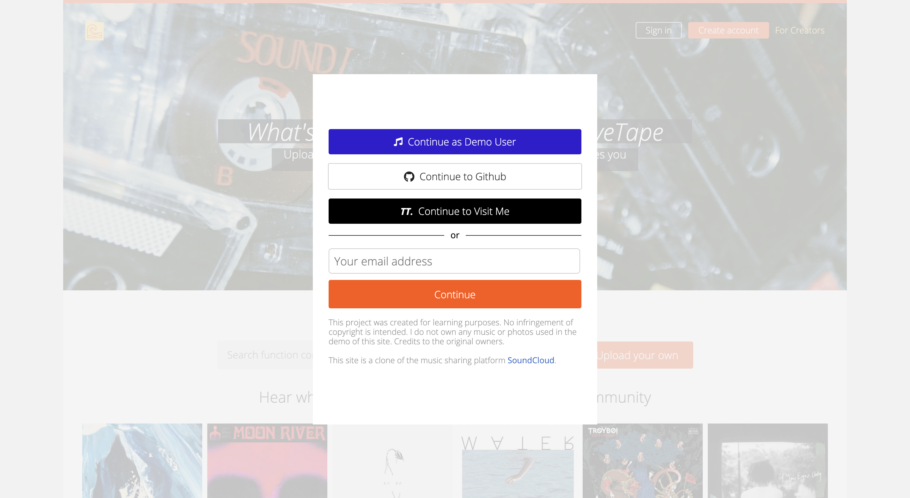
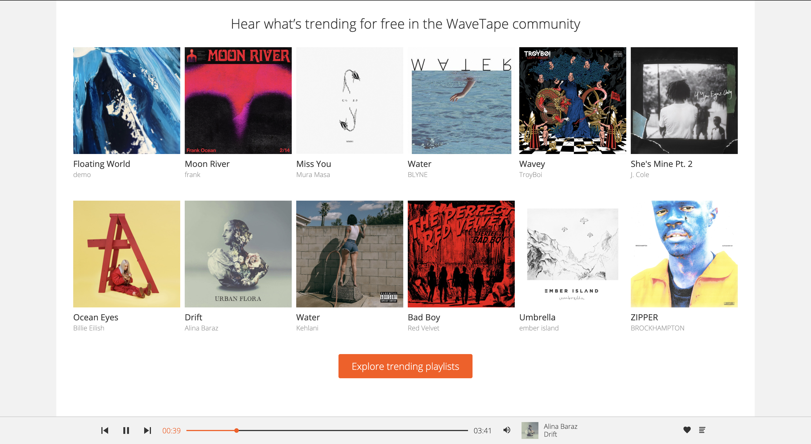
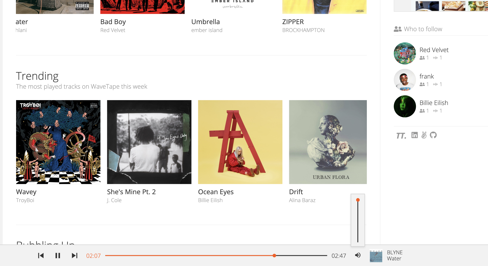
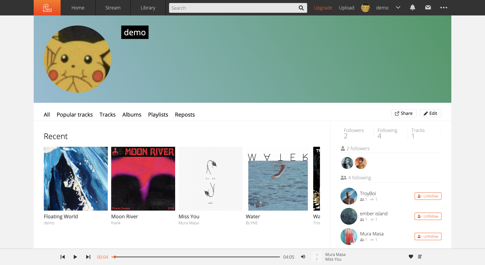
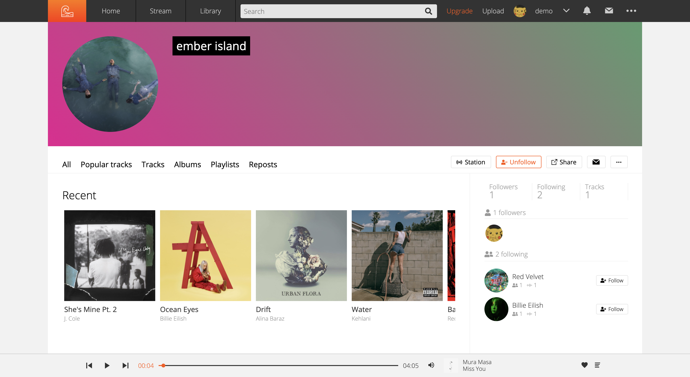

# [WaveTape](https://wave-tape.herokuapp.com/#/) 🌊

## [Design Documents](https://github.com/tt954/wavetape/wiki)

***

## Technologies

+ [`Ruby on Rails`](https://rubyonrails.org/) server-side framework written in Ruby
+ [`React`](https://reactjs.org/) with [Redux](https://redux.js.org/), frontend Javascript framework
+ [`PostgreSQL`](https://www.postgresql.org/) database and [`AWS S3`](https://aws.amazon.com/s3/) for media storage
+ [`Heroku`](https://www.heroku.com/) cloud hosting platform
+ Other dependencies include: [bcrypt](https://www.npmjs.com/package/bcrypt) (password encryption), [jbuilder](https://github.com/rails/jbuilder) (build JSON APIs with ease)

***

## Featured functionality
**User Authentication**
+ User can sign up, sign in, and sign out through a multistage session form.
+ User can use the demo user feature to navigate the site without having to create an account. 
+ Certain features, such as uploading a track or commenting a track, are available only when logged in.

  |  
:-------------------------:|:-------------------------:
landing page | signup and signin

**Music player**
+ Music can be played uninterrupted as the user navigate throughout the site.
+ User can still listen to music even when not logged in. 
+ User can adjust audio volume as well as skip next or replay the previous song.

  |  
:-------------------------:|:-------------------------:
music player | controls

**User profile pages**
+ User profile displays information such as uploaded tracks, profile photo, etc.
+ Artist can follow/unfollow one another.

  |  
:-------------------------:|:-------------------------:
profile home | other artist profile

***

## Coming Soon 
+ The ability to upload track as well as navigate to its show page.
+ Artist can leave comments.
+ Artist can like a track. 
+ Users can search for tracks.

